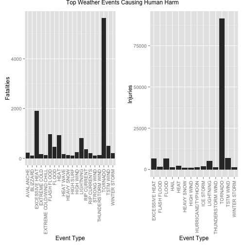
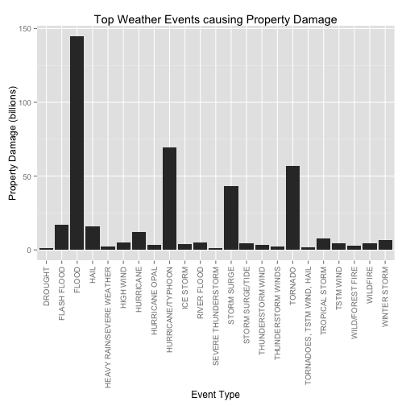
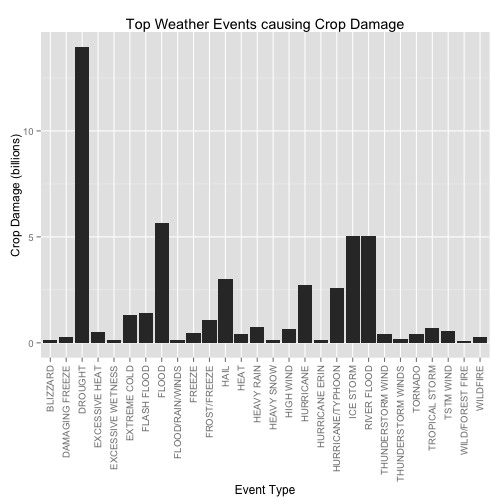

# Severe Weather Events that have Greatest Health and Economic Consequences

## Synopsis
This report attempts to answer two questions - 1. Across the United States, which types of weather events are most harmful with respect to population health?, 2. Across the United States, which types of events have the greatest economic consequences?. U.S. National Oceanic and Atmospheric Administration's (NOAA) storm database is used for the analysis. It is observed that Tornados caused most harm to population health whereas Drought caused greatest economic damage.

Weather-related deaths amounted to 15,145. Out of these, 5,633 deaths were caused by Tornados and execssive heat caused 1,903 deaths. Flash Floods, Lightning, and Thurnderstorm Winds caused significant fatalities. 

Weather-related injuries amounted to 140,528. Out of these, Tornado caused 91,346 injuries. Winds, Floods, Excessive Heat, Lightning, Ice Storms, Hail, Hurricanes, Heavy Snows added to more injuries. 

Severe weather resulted in $477 billion combined property and crop damages. Out of the $428 billion in property damages, Floods caused $144 billion, Hurricanes/Typhoons caused $80 billion, Tornados caused $57 billion, and Hail, Winter Storm, High Winds, Wild Fires also contributed significantly to the damages.

Out of the $49 billion in crop damages, Drought resulted in $13.9 billion, Floods in $11.6 billion, followed by Ice Storm, Hail and Hurricanes. 

## Loading and Processing the Raw Data
The data for this analysis comes from [Storm Data](https://d396qusza40orc.cloudfront.net/repdata%2Fdata%2FStormData.csv.bz2) in bzip2 compressed CSV format. The events in the database start in the year 1950 and end in November 2011. In the earlier years of the database there are generally fewer events recorded, most likely due to a lack of good records. More recent years should be considered more complete.

### Reading the data
First unzip the bzip2 compressed file, process the CSV formatted data and read into a data table.


```r
library(data.table)
NOAA.DT = data.table(read.csv(bzfile("repdata-data-StormData.csv.bz2")))
```


Check the first few rows. There are **902,297** rows in this dataset.

```r
dim(NOAA.DT)
```

```
## [1] 902297     37
```

```r
head(NOAA.DT, 5)
```

```
##    STATE__           BGN_DATE BGN_TIME TIME_ZONE COUNTY COUNTYNAME STATE
## 1:       1  4/18/1950 0:00:00     0130       CST     97     MOBILE    AL
## 2:       1  4/18/1950 0:00:00     0145       CST      3    BALDWIN    AL
## 3:       1  2/20/1951 0:00:00     1600       CST     57    FAYETTE    AL
## 4:       1   6/8/1951 0:00:00     0900       CST     89    MADISON    AL
## 5:       1 11/15/1951 0:00:00     1500       CST     43    CULLMAN    AL
##     EVTYPE BGN_RANGE BGN_AZI BGN_LOCATI END_DATE END_TIME COUNTY_END
## 1: TORNADO         0                                               0
## 2: TORNADO         0                                               0
## 3: TORNADO         0                                               0
## 4: TORNADO         0                                               0
## 5: TORNADO         0                                               0
##    COUNTYENDN END_RANGE END_AZI END_LOCATI LENGTH WIDTH F MAG FATALITIES
## 1:         NA         0                      14.0   100 3   0          0
## 2:         NA         0                       2.0   150 2   0          0
## 3:         NA         0                       0.1   123 2   0          0
## 4:         NA         0                       0.0   100 2   0          0
## 5:         NA         0                       0.0   150 2   0          0
##    INJURIES PROPDMG PROPDMGEXP CROPDMG CROPDMGEXP WFO STATEOFFIC ZONENAMES
## 1:       15    25.0          K       0                                    
## 2:        0     2.5          K       0                                    
## 3:        2    25.0          K       0                                    
## 4:        2     2.5          K       0                                    
## 5:        2     2.5          K       0                                    
##    LATITUDE LONGITUDE LATITUDE_E LONGITUDE_ REMARKS REFNUM
## 1:     3040      8812       3051       8806              1
## 2:     3042      8755          0          0              2
## 3:     3340      8742          0          0              3
## 4:     3458      8626          0          0              4
## 5:     3412      8642          0          0              5
```


Filter out the observations if fatalities or injuries or crop damage or property damage have zero values. This will allow us to work with a smaller subset of the data.

```r
noaa.non.zero.data = NOAA.DT[NOAA.DT$FATALITIES > 0 | NOAA.DT$INJURIES > 0 | 
    NOAA.DT$PROPDMG > 0 | NOAA.DT$CROPDMG > 0, ]
dim(noaa.non.zero.data)
```

```
## [1] 254633     37
```


Interested in **EVTYPE, FATALITIES, INJURIES, PROPDMG and CROPDMG** columns as they are related to human health and economic consequences. Extract these columns and print their brief summary. **Observe that there are no missing values.**


```r
summary(NOAA.DT$EVTYPE)
```

```
##                     HAIL                TSTM WIND        THUNDERSTORM WIND 
##                   288661                   219940                    82563 
##                  TORNADO              FLASH FLOOD                    FLOOD 
##                    60652                    54277                    25326 
##       THUNDERSTORM WINDS                HIGH WIND                LIGHTNING 
##                    20843                    20212                    15754 
##               HEAVY SNOW               HEAVY RAIN             WINTER STORM 
##                    15708                    11723                    11433 
##           WINTER WEATHER             FUNNEL CLOUD         MARINE TSTM WIND 
##                     7026                     6839                     6175 
## MARINE THUNDERSTORM WIND               WATERSPOUT              STRONG WIND 
##                     5812                     3796                     3566 
##     URBAN/SML STREAM FLD                 WILDFIRE                 BLIZZARD 
##                     3392                     2761                     2719 
##                  DROUGHT                ICE STORM           EXCESSIVE HEAT 
##                     2488                     2006                     1678 
##               HIGH WINDS         WILD/FOREST FIRE             FROST/FREEZE 
##                     1533                     1457                     1342 
##                DENSE FOG       WINTER WEATHER/MIX           TSTM WIND/HAIL 
##                     1293                     1104                     1028 
##  EXTREME COLD/WIND CHILL                     HEAT                HIGH SURF 
##                     1002                      767                      725 
##           TROPICAL STORM           FLASH FLOODING             EXTREME COLD 
##                      690                      682                      655 
##            COASTAL FLOOD         LAKE-EFFECT SNOW        FLOOD/FLASH FLOOD 
##                      650                      636                      624 
##                LANDSLIDE                     SNOW          COLD/WIND CHILL 
##                      600                      587                      539 
##                      FOG              RIP CURRENT              MARINE HAIL 
##                      538                      470                      442 
##               DUST STORM                AVALANCHE                     WIND 
##                      427                      386                      340 
##             RIP CURRENTS              STORM SURGE            FREEZING RAIN 
##                      304                      261                      250 
##              URBAN FLOOD     HEAVY SURF/HIGH SURF        EXTREME WINDCHILL 
##                      249                      228                      204 
##             STRONG WINDS           DRY MICROBURST    ASTRONOMICAL LOW TIDE 
##                      196                      186                      174 
##                HURRICANE              RIVER FLOOD               LIGHT SNOW 
##                      174                      173                      154 
##         STORM SURGE/TIDE            RECORD WARMTH         COASTAL FLOODING 
##                      148                      146                      143 
##               DUST DEVIL         MARINE HIGH WIND        UNSEASONABLY WARM 
##                      141                      135                      126 
##                 FLOODING   ASTRONOMICAL HIGH TIDE        MODERATE SNOWFALL 
##                      120                      103                      101 
##           URBAN FLOODING               WINTRY MIX        HURRICANE/TYPHOON 
##                       98                       90                       88 
##            FUNNEL CLOUDS               HEAVY SURF              RECORD HEAT 
##                       87                       84                       81 
##                   FREEZE                HEAT WAVE                     COLD 
##                       74                       74                       72 
##              RECORD COLD                      ICE  THUNDERSTORM WINDS HAIL 
##                       64                       61                       61 
##      TROPICAL DEPRESSION                    SLEET         UNSEASONABLY DRY 
##                       60                       59                       56 
##                    FROST              GUSTY WINDS      THUNDERSTORM WINDSS 
##                       53                       53                       51 
##       MARINE STRONG WIND                    OTHER               SMALL HAIL 
##                       48                       48                       47 
##                   FUNNEL             FREEZING FOG             THUNDERSTORM 
##                       46                       45                       45 
##       Temperature record          TSTM WIND (G45)         Coastal Flooding 
##                       43                       39                       38 
##              WATERSPOUTS    MONTHLY PRECIPITATION                    WINDS 
##                       37                       36                       36 
##                  (Other) 
##                     2940
```

```r
mean(is.na(NOAA.DT$EVTYPE))
```

```
## [1] 0
```

```r
summary(NOAA.DT$FATALITIES)
```

```
##    Min. 1st Qu.  Median    Mean 3rd Qu.    Max. 
##       0       0       0       0       0     583
```

```r
mean(is.na(NOAA.DT$FATALITIES))
```

```
## [1] 0
```

```r
summary(NOAA.DT$INJURIES)
```

```
##    Min. 1st Qu.  Median    Mean 3rd Qu.    Max. 
##     0.0     0.0     0.0     0.2     0.0  1700.0
```

```r
mean(is.na(NOAA.DT$INJURIES))
```

```
## [1] 0
```

```r
summary(NOAA.DT$PROPDMG)
```

```
##    Min. 1st Qu.  Median    Mean 3rd Qu.    Max. 
##       0       0       0      12       0    5000
```

```r
mean(is.na(NOAA.DT$PROPDMG))
```

```
## [1] 0
```

```r
summary(NOAA.DT$CROPDMG)
```

```
##    Min. 1st Qu.  Median    Mean 3rd Qu.    Max. 
##     0.0     0.0     0.0     1.5     0.0   990.0
```

```r
mean(is.na(NOAA.DT$CROPDMG))
```

```
## [1] 0
```


## Results

### Events that are most harmful to population health
In order to arrive at this, consider EVTYPE, FATALITIES and INJURIES columns in the dataset. Aggregate FATALITIES and INJURIES by EVTTYPE and sort them in decresing order. Select the top few EVTYPEs.

```r
library(data.table)
fatalities.by.evtype = noaa.non.zero.data[, list(Fatalities = sum(FATALITIES)), 
    by = list(EVTYPE)][order(Fatalities, decreasing = TRUE)][Fatalities > 100]
fatalities.by.evtype
```

```
##                      EVTYPE Fatalities
##  1:                 TORNADO       5633
##  2:          EXCESSIVE HEAT       1903
##  3:             FLASH FLOOD        978
##  4:                    HEAT        937
##  5:               LIGHTNING        816
##  6:               TSTM WIND        504
##  7:                   FLOOD        470
##  8:             RIP CURRENT        368
##  9:               HIGH WIND        248
## 10:               AVALANCHE        224
## 11:            WINTER STORM        206
## 12:            RIP CURRENTS        204
## 13:               HEAT WAVE        172
## 14:            EXTREME COLD        160
## 15:       THUNDERSTORM WIND        133
## 16:              HEAVY SNOW        127
## 17: EXTREME COLD/WIND CHILL        125
## 18:             STRONG WIND        103
## 19:               HIGH SURF        101
## 20:                BLIZZARD        101
```

```r
injuries.by.evtype = noaa.non.zero.data[, list(Injuries = sum(INJURIES)), by = EVTYPE][order(Injuries, 
    decreasing = TRUE)][Injuries > 1000]
injuries.by.evtype
```

```
##                EVTYPE Injuries
##  1:           TORNADO    91346
##  2:         TSTM WIND     6957
##  3:             FLOOD     6789
##  4:    EXCESSIVE HEAT     6525
##  5:         LIGHTNING     5230
##  6:              HEAT     2100
##  7:         ICE STORM     1975
##  8:       FLASH FLOOD     1777
##  9: THUNDERSTORM WIND     1488
## 10:              HAIL     1361
## 11:      WINTER STORM     1321
## 12: HURRICANE/TYPHOON     1275
## 13:         HIGH WIND     1137
## 14:        HEAVY SNOW     1021
```

A total of **15,145** weather related deaths and **140,528** injuries are reported. Plot bar graphs for Fatalities and Injuries across all the EVTYPEs. One can figure out the top weather events that cause great human health hazards.

```r
library(ggplot2)
library(gridExtra)
```

```
## Loading required package: grid
```

```r
g = ggplot(fatalities.by.evtype, aes(EVTYPE, Fatalities))
graph1 = g + geom_bar(stat = "identity") + theme(axis.text.x = element_text(angle = 90, 
    vjust = 0.5, hjust = 1)) + labs(x = "Event Type")

g = ggplot(injuries.by.evtype, aes(EVTYPE, Injuries))
graph2 = g + geom_bar(stat = "identity") + theme(axis.text.x = element_text(angle = 90, 
    vjust = 0.5, hjust = 1)) + labs(x = "Event Type")

grid.arrange(graph1, graph2, ncol = 2, main = "Top Weather Events Causing Human Harm")
```

 


### Events that have greatest economic consequences.

To analyse this, consider the columns PROPDMG, PROPDMGEXP, CROPDMG, CROPDMGEXP. Observe the levels of the exponent columns.

```r
levels(noaa.non.zero.data$PROPDMGEXP)
```

```
##  [1] ""  "+" "-" "0" "1" "2" "3" "4" "5" "6" "7" "8" "?" "B" "H" "K" "M"
## [18] "h" "m"
```

```r
levels(noaa.non.zero.data$CROPDMGEXP)
```

```
## [1] ""  "0" "2" "?" "B" "K" "M" "k" "m"
```


After careful review of the remarks for some observations with ambiguous exponents like "", "-", "+", "?", etc. it was decided to use a default exponent of millions as indicated by the extent of damage done. The rest of the exponents are replaced by their equivalent numerical values like "1000" for "K" or "k", "1000000" for "M" or "m", and so on...


```r
noaa.non.zero.data$PROPDMGEXP = as.character(noaa.non.zero.data$PROPDMGEXP)
noaa.non.zero.data$PROPDMGEXP[noaa.non.zero.data$PROPDMGEXP == "0"] = 1
noaa.non.zero.data$PROPDMGEXP[noaa.non.zero.data$PROPDMGEXP == "1"] = 10
noaa.non.zero.data$PROPDMGEXP[noaa.non.zero.data$PROPDMGEXP == "2"] = 100
noaa.non.zero.data$PROPDMGEXP[noaa.non.zero.data$PROPDMGEXP == "H"] = 100
noaa.non.zero.data$PROPDMGEXP[noaa.non.zero.data$PROPDMGEXP == "h"] = 100
noaa.non.zero.data$PROPDMGEXP[noaa.non.zero.data$PROPDMGEXP == "3"] = 1000
noaa.non.zero.data$PROPDMGEXP[noaa.non.zero.data$PROPDMGEXP == "K"] = 1000
noaa.non.zero.data$PROPDMGEXP[noaa.non.zero.data$PROPDMGEXP == "k"] = 1000
noaa.non.zero.data$PROPDMGEXP[noaa.non.zero.data$PROPDMGEXP == "4"] = 10000
noaa.non.zero.data$PROPDMGEXP[noaa.non.zero.data$PROPDMGEXP == "5"] = 1e+05
noaa.non.zero.data$PROPDMGEXP[noaa.non.zero.data$PROPDMGEXP == "6"] = 1e+06
noaa.non.zero.data$PROPDMGEXP[noaa.non.zero.data$PROPDMGEXP == "M"] = 1e+06
noaa.non.zero.data$PROPDMGEXP[noaa.non.zero.data$PROPDMGEXP == "m"] = 1e+06
noaa.non.zero.data$PROPDMGEXP[noaa.non.zero.data$PROPDMGEXP == ""] = 1e+06
noaa.non.zero.data$PROPDMGEXP[noaa.non.zero.data$PROPDMGEXP == "+"] = 1e+06
noaa.non.zero.data$PROPDMGEXP[noaa.non.zero.data$PROPDMGEXP == "-"] = 1e+06
noaa.non.zero.data$PROPDMGEXP[noaa.non.zero.data$PROPDMGEXP == "?"] = 1e+06
noaa.non.zero.data$PROPDMGEXP[noaa.non.zero.data$PROPDMGEXP == "7"] = 1e+07
noaa.non.zero.data$PROPDMGEXP[noaa.non.zero.data$PROPDMGEXP == "8"] = 1e+08
noaa.non.zero.data$PROPDMGEXP[noaa.non.zero.data$PROPDMGEXP == "B"] = 1e+09
```


Compute the property damage by aggregating the product of PROPDMG and PROPDMGEXP columns. Consider damages greater than a Billion as significant.

```r
property.damage.by.evtype = noaa.non.zero.data[, list(Property.Damage = sum(as.integer(PROPDMGEXP) * 
    PROPDMG)), by = EVTYPE]
top.property.damage = property.damage.by.evtype[order(Property.Damage, decreasing = TRUE)][Property.Damage > 
    1e+09]
top.property.damage
```

```
##                         EVTYPE Property.Damage
##  1:                      FLOOD       1.447e+11
##  2:          HURRICANE/TYPHOON       6.931e+10
##  3:                    TORNADO       5.701e+10
##  4:                STORM SURGE       4.332e+10
##  5:                FLASH FLOOD       1.703e+10
##  6:                       HAIL       1.579e+10
##  7:                  HURRICANE       1.187e+10
##  8:             TROPICAL STORM       7.704e+09
##  9:               WINTER STORM       6.688e+09
## 10:                  HIGH WIND       5.305e+09
## 11:                RIVER FLOOD       5.119e+09
## 12:                   WILDFIRE       4.765e+09
## 13:           STORM SURGE/TIDE       4.641e+09
## 14:                  TSTM WIND       4.485e+09
## 15:                  ICE STORM       3.945e+09
## 16:          THUNDERSTORM WIND       3.485e+09
## 17:             HURRICANE OPAL       3.173e+09
## 18:           WILD/FOREST FIRE       3.002e+09
## 19:  HEAVY RAIN/SEVERE WEATHER       2.500e+09
## 20:         THUNDERSTORM WINDS       2.146e+09
## 21: TORNADOES, TSTM WIND, HAIL       1.600e+09
## 22:        SEVERE THUNDERSTORM       1.205e+09
## 23:                    DROUGHT       1.046e+09
##                         EVTYPE Property.Damage
```


Plot a graph to show the events causing greatest property damage.

```r
library(ggplot2)
g = ggplot(top.property.damage, aes(EVTYPE, Property.Damage/1e+09))
g + geom_bar(stat = "identity") + theme(axis.text.x = element_text(angle = 90, 
    vjust = 0.5, hjust = 1)) + labs(title = "Top Weather Events causing Property Damage") + 
    labs(x = "Event Type") + labs(y = "Property Damage (billions)")
```

 


Do the same for crop damage.

```r
noaa.non.zero.data$CROPDMGEXP = as.character(noaa.non.zero.data$CROPDMGEXP)
noaa.non.zero.data$CROPDMGEXP[noaa.non.zero.data$CROPDMGEXP == "0"] = 1
noaa.non.zero.data$CROPDMGEXP[noaa.non.zero.data$CROPDMGEXP == "2"] = 100
noaa.non.zero.data$CROPDMGEXP[noaa.non.zero.data$CROPDMGEXP == "K"] = 1000
noaa.non.zero.data$CROPDMGEXP[noaa.non.zero.data$CROPDMGEXP == "k"] = 1000
noaa.non.zero.data$CROPDMGEXP[noaa.non.zero.data$CROPDMGEXP == "?"] = 1e+06
noaa.non.zero.data$CROPDMGEXP[noaa.non.zero.data$CROPDMGEXP == ""] = 1e+06
noaa.non.zero.data$CROPDMGEXP[noaa.non.zero.data$CROPDMGEXP == "M"] = 1e+06
noaa.non.zero.data$CROPDMGEXP[noaa.non.zero.data$CROPDMGEXP == "m"] = 1e+06
noaa.non.zero.data$CROPDMGEXP[noaa.non.zero.data$CROPDMGEXP == "B"] = 1e+09
```


```r
crop.damage.by.evtype = noaa.non.zero.data[, list(Crop.Damage = sum(as.integer(CROPDMGEXP) * 
    CROPDMG)), by = EVTYPE]
top.crop.damage = crop.damage.by.evtype[order(Crop.Damage, decreasing = TRUE)][Crop.Damage > 
    1e+08]
top.crop.damage
```

```
##                 EVTYPE Crop.Damage
##  1:            DROUGHT   1.397e+10
##  2:              FLOOD   5.662e+09
##  3:        RIVER FLOOD   5.029e+09
##  4:          ICE STORM   5.022e+09
##  5:               HAIL   3.029e+09
##  6:          HURRICANE   2.742e+09
##  7:  HURRICANE/TYPHOON   2.608e+09
##  8:        FLASH FLOOD   1.421e+09
##  9:       EXTREME COLD   1.293e+09
## 10:       FROST/FREEZE   1.094e+09
## 11:         HEAVY RAIN   7.334e+08
## 12:     TROPICAL STORM   6.783e+08
## 13:          HIGH WIND   6.386e+08
## 14:          TSTM WIND   5.540e+08
## 15:     EXCESSIVE HEAT   4.924e+08
## 16:             FREEZE   4.462e+08
## 17:            TORNADO   4.150e+08
## 18:  THUNDERSTORM WIND   4.148e+08
## 19:               HEAT   4.015e+08
## 20:           WILDFIRE   2.955e+08
## 21:    DAMAGING FREEZE   2.621e+08
## 22: THUNDERSTORM WINDS   1.987e+08
## 23:  EXCESSIVE WETNESS   1.420e+08
## 24:     HURRICANE ERIN   1.360e+08
## 25:         HEAVY SNOW   1.347e+08
## 26:   FLOOD/RAIN/WINDS   1.128e+08
## 27:           BLIZZARD   1.121e+08
## 28:   WILD/FOREST FIRE   1.068e+08
##                 EVTYPE Crop.Damage
```


```r
g = ggplot(top.crop.damage, aes(EVTYPE, Crop.Damage/1e+09))
g + geom_bar(stat = "identity") + theme(axis.text.x = element_text(angle = 90, 
    vjust = 0.5, hjust = 1)) + labs(title = "Top Weather Events causing Crop Damage") + 
    labs(x = "Event Type") + labs(y = "Crop Damage (billions)")
```

 


Total property damages amounted to **$428,884,342,083**. Total crop damages amounted to **$49,115,192,170**
